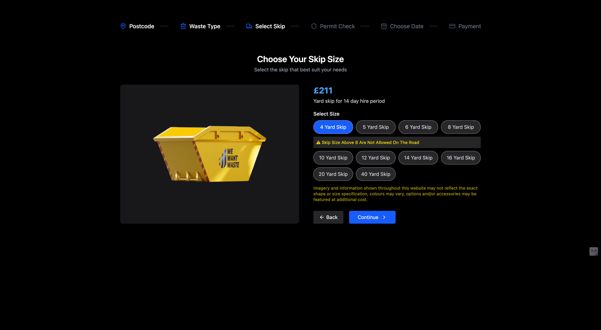
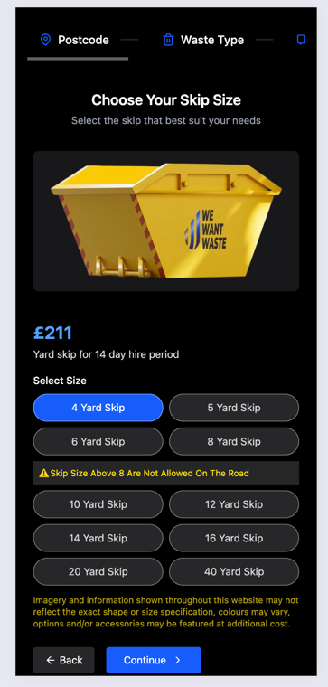
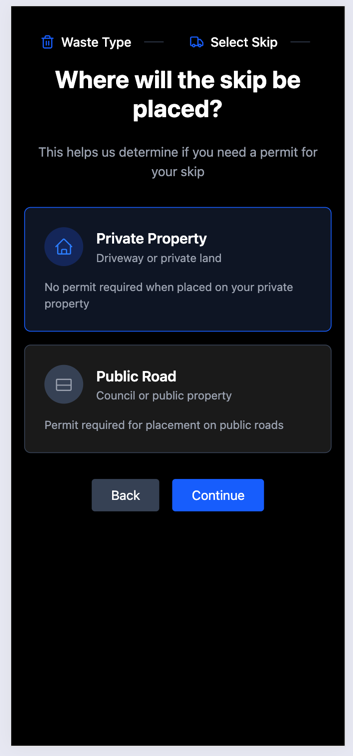

# React Frontend Challenge – Wewantwaste Skip Selection Redesign

Hi, I'm Henok
This is my submission for the front-end coding challenge provided by Wewantwaste. The task involved redesigning the "Choose your skip size" page to improve the UI/UX, maintain functionality, and ensure responsiveness across devices.

### 📌 Challenge Brief

Redesign the "Choose your skip size" page at:

> https://wewantwaste.co.uk → Enter postcode LE10 1SH → Select an address → Garden waste → Skip size page

- The functionality should remain unchanged.

- UI/UX should be modern, responsive, and accessible https://www.figma.com/design/HxSHgfB6EK7RL0iPweHHmW/HF?node-id=569-1071&p=f.

- Used this API to fetch real skip data:
  https://app.wewantwaste.co.uk/api/skips/by-location?postcode=NR32&area=Lowestoft

### 🧠 My Approach

1. Framework: Built using React with Vite for fast bundling and dev experience.

2. Styling: Used TailwindCSS for utility-first styling and responsiveness.

3. Component Design:

   -  Each skip option is presented as an interactive button styled as a dynamic card that reflects the corresponding skip size (in yards).
   - Clickable UI elements have hover/focus states for accessibility.

4. Responsiveness:

   - Mobile-first design approach.
   - Flexbox and Grid layouts used for adaptability.

5. UX Enhancements:

   - Visual hierarchy for skip sizes.
   - Clear call-to-action buttons.
   - Friendly color palette and readable typography.

### 📸 Screenshots

Desktop and Mobile


### 🔧 Getting Started

To run the app locally:

#### 1. Clone the repository

> git clone https://github.com/henok-projects/garden-waste-redesign.git
>
> cd frontend

#### 2. Install dependencies

> npm install

#### Start the dev server

> npm run dev

Visit http://localhost:5173 in your browser.

### 🔗 Live Demo & Submission Links

- GitHub Repo: https://github.com/henok-projects/garden-waste-redesign.git
- Sandbox / Live URL: https://garden-waste-redesign.vercel.app/ (Vercel)
- UU/UX https://www.figma.com/design/HxSHgfB6EK7RL0iPweHHmW/HF?node-id=569-1071&p=f

### 📁 Project Structure

```bash
    frontend/
    ├── public/
    ├── src/
    │ ├── components/
    │ ├── assets/
    │ ├── App.jsx
    │ ├── main.jsx
    │ └── index.css
    ├── index.html
    ├── vite.config.js
    └── README.md
```

🙌 Thank You
Thank you for the opportunity!

Looking forward to your feedback.

— Henok Addis

Software Engineer
